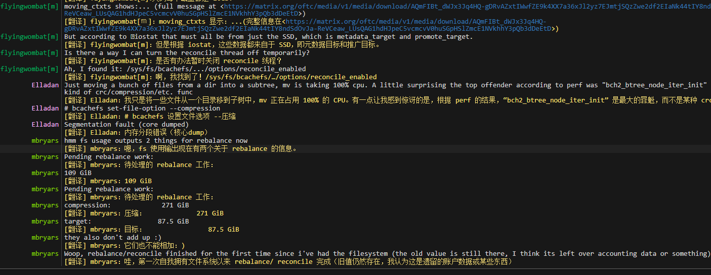

# weechat-translate-gpt
use gpt translate for weechat

需要配置环境变量，比如我其实使用的是ollama

``` env title=".env"
OPENAI_API_URL="http://192.168.x.x:11434/v1/chat/completions"
OPENAI_API_KEY=""
OPENAI_MODEL="llama3"
TARGET_LANG="Chinese"
MAX_CONTEXT=15
```

程序依赖 pthon3-requests

如果使用docker部署（比如我）, 参考的dockerfile：
``` 
FROM  weechat/weechat

USER root
RUN apt update -y && apt install -y python3-requests
USER user
```

参考的docker-compose:
``` yml title="docker-comose.yml"
services:
  weechat:
    #image: weechat/weechat
    build:
      context: ./docker
      dockerfile: weechat.dockerfile
    env_file: .env
    volumes:
      - ./config:/home/user/.config/weechat
      - ./data:/home/user/.local/share/weechat
      - ./translate_gpt.py:/home/user/.local/share/weechat/python/autoload/translate_gpt.py:ro
      - ./cache:/home/user/.cache/weechat
    command: >
      weechat-headless

```

截图:

